# Performance Report

## Initial Report

### 1. Sorting Countries

- **Render Duration:** 243 ms
- **Commit Duration:** < 0.1 ms (Layout/Passive effects)
- **What Caused Update:** Root `App` component state change
- **Bottleneck Analysis:** Toggling the sorting criteria results in a heavy **243ms** rendering delay. The **Flamegraph** reveals a massive, uninterrupted block of sequential rendering operations, while the **Ranked Chart** details that parent elements like `App` (7ms), `YearSelector` (6ms), and `CountryList` (5ms) are computationally lightweight on their own. The true bottleneck is cumulative: the entire grid structure—specifically the un-memoized `CountryCard` elements (e.g., keys 241, 8, 83, 236) and internal `DataTable` structures—runs its evaluation cycles completely from scratch across the entire dataset when the sort order shifts.

- **Screenshots:**

  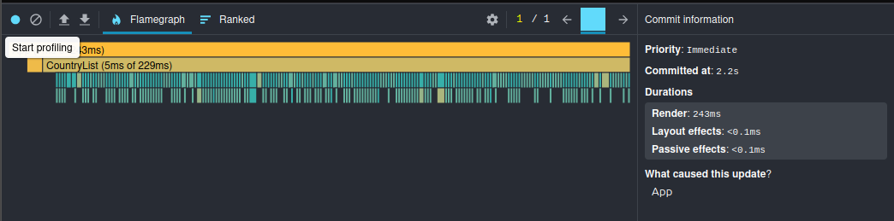
  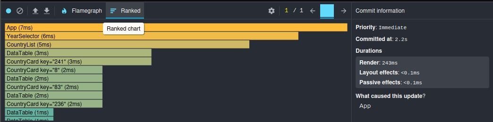

---

### 2. Searching for a Country

- **Render Duration:** 279 ms
- **Commit Duration:** < 0.1 ms (Layout/Passive effects)
- **What Caused Update:** Root `App` component state mutation (Search text query updated)
- **Bottleneck Analysis:** Typing a search query triggers a global dataset filter, showing an expensive **279ms** rendering duration. The **Flamegraph** captures a dense sea of simultaneous child execution blocks under `CountryList`, while the **Ranked Chart** shows that the parent `CountryList` layout wrapper single-handedly demands **78ms** just to handle the un-optimized data structures. The remainder of the 279ms is drained sequentially by individual `CountryCard` structures and `DataTable` sub-elements. Because there is no list virtualization or reference caching, typing even a single character forces the browser to discard hundreds of old nodes and mount new ones simultaneously, causing noticeable thread blocks.
- **Screenshots:**

  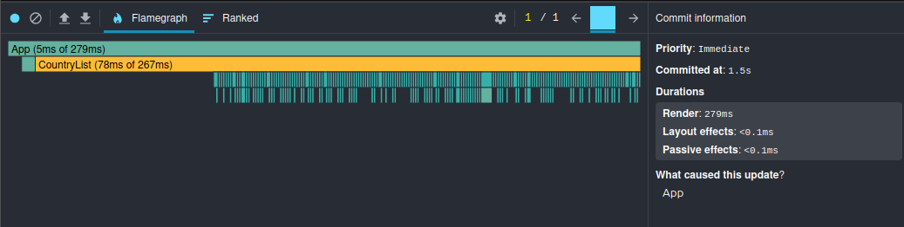
  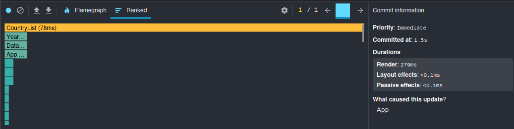

---

### 3. Selecting a Different Year

- **Render Duration:** 348 ms
- **Commit Duration:** < 0.1 ms (Layout/Passive effects)
- **What Caused Update:** Root `App` component state change selection
- **Bottleneck Analysis:** Changing the global year filter yields the highest baseline lag spike at **348ms**. The **Ranked Chart** captures severe structural bottlenecks: the parent `CountryList` wrapper single-handedly spends **108ms** processing the updated dataset array, while the un-memoized child cards sequentially drain the remaining **240ms**. Without data derivation memoization or row caching, a single dropdown click forces the browser to hang for over a third of a second.
- **Screenshots:**

  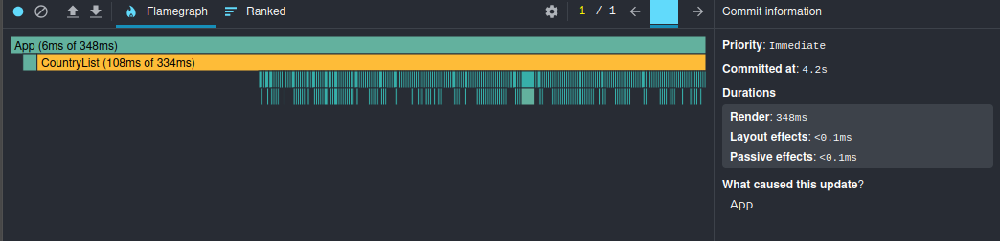
  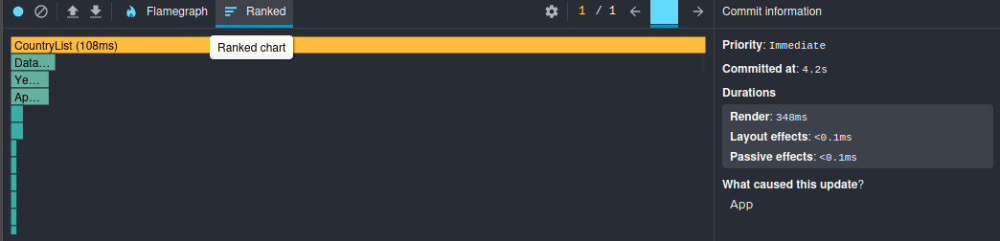

---

### 4. Toggling Columns

- **Render Duration:** 299 ms
- **Commit Duration:** < 0.1 ms (Layout/Passive effects)
- **What Caused Update:** Root `App` state change selection
- **Bottleneck Analysis:** Changing column visibility settings causes a major lag spike of **299ms**. The **Flamegraph** and **Ranked Chart** clearly expose the structural weakness: the parent `CountryList` wrapper spends **85ms** processing the structural change, while the rest of the execution time is drained by an un-memoized cascade of nested child grids. Even though the underlying emissions data hasn't changed at all, toggling a column visibility checkbox forces every single row and data cell to completely recalculate and re-evaluate its layout from scratch.
- **Screenshots:**

  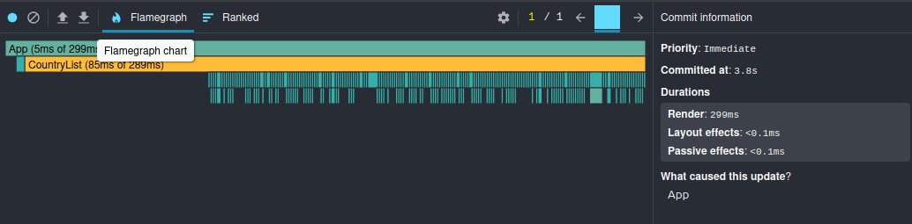
  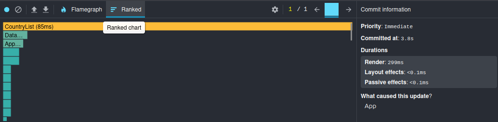

---

## Report After Changes

### 1. Sorting Countries Updated

- **Render Duration:** 10 ms
- **Commit Duration:** 1 ms (Layout effects) / < 0.1 ms (Passive effects)
- **What Caused Update:** Root `App` component state change (triggered via sorting/filtering actions tracking down through the tree)
- **Bottleneck Analysis:** Toggling the sorting criteria or changing fields now results in an instantaneous **10ms** render duration, fully eliminating the previous 243ms bottleneck. The **Flamegraph** confirms that the sequential rendering block has been completely smashed. The parent `CountryList` component spends a mere 1ms of self-execution time (out of 9ms total in its frame sub-slice) passing layout calculations. Thanks to the virtualization layer, the browser completely skips processing off-screen elements. The engine only updates the lightweight, visible `CountryCard` nodes currently tracked within the window track, delivering flat execution cycles and immediate frame responses when the dataset sort order changes.
- **Screenshots:**

  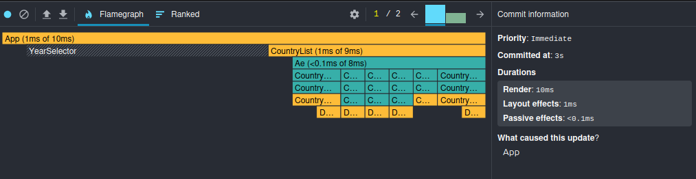

---

### 2. Searching for a Country Updated

- **Render Duration:** 12 ms
- **Commit Duration:** 1 ms (Layout effects) / < 0.1 ms (Passive effects)
- **What Caused Update:** Root `App` component state mutation (Search text query updated)
- **Bottleneck Analysis:** Typing a search query or filtering the list now takes an instantaneous **12ms**, fully wiping out the previous 279ms bottleneck. The **Flamegraph** demonstrates that the massive rendering block has been completely eliminated. The parent `CountryList` component now only takes 1ms of self-execution time (out of 9ms total within the sub-tree layout track). Thanks to the virtualization layer, the browser completely bypasses the expensive overhead of destroying and mounting hundreds of DOM nodes upon every keystroke. Instead, the engine dynamically recalculates the indices and updates only the handful of visible `CountryCard` elements inside the viewport window, ensuring perfectly smooth frame updates during live filtering.
- **Screenshots:**

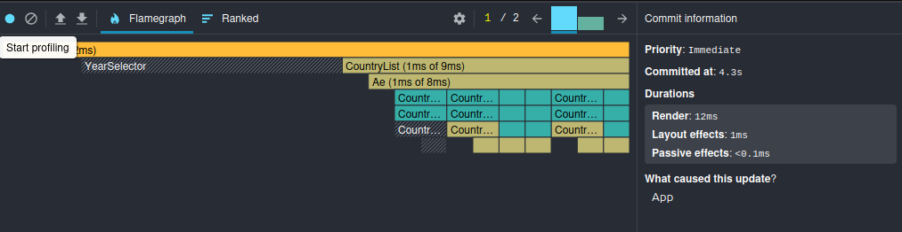

---

### 3. Selecting a Different Year Updated

- **Render Duration:** 35 ms
- **Commit Duration:** 2 ms (Layout effects) / < 0.1 ms (Passive effects)
- **What Caused Update:** Root `App` component state change selection (triggered via `YearSelector`)
- **Bottleneck Analysis:** Changing the global year filter now processes in a swift **35ms**, completely eliminating the massive 348ms lag spike. The **Flamegraph** reveals a massive structural improvement: the parent `CountryList` component now uses a mere 1ms of self-execution time (out of 11ms for its sub-tree track), meaning the previous 108ms array bottleneck is entirely gone. The rest of the rendering duration is cleanly isolated within the `YearSelector` component itself (19ms of 21ms), while the list component avoids any sequential draining. Thanks to list virtualization, the application completely bypasses the need to discard and re-mount hundreds of cards upon a year change, calculating and updating only the visible nodes inside the active viewport track.
- **Screenshots:**

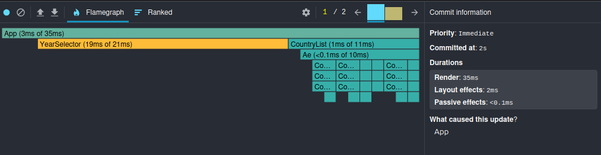

---

### 4. Toggling Columns Updated

- **Render Duration:** 7 ms
- **Commit Duration:** 2 ms (Layout effects) / < 0.1 ms (Passive effects)
- **What Caused Update:** Root `App` state change selection (Column filters updated)
- **Bottleneck Analysis:** Changing column visibility settings now updates in a blazing fast **7ms**, completely wiping out the previous 299ms lag spike. The **Flamegraph** showcases an elite profile: the parent `CountryList` component registers at `<0.1ms` of self-execution time, completely resolving the previous 85ms array processing block. The entire layout track under the internal wrapper component (`Ae`) handles the sub-tree updates in a mere 1ms (out of 6ms total). Thanks to list virtualization, the application completely bypasses the catastrophic performance cost of unmounting and remounting the un-memoized nested cell structures for the entire dataset. The browser layout engine only re-evaluates and reconstructs the active, visible row nodes within the viewport track, keeping thread execution perfectly flat and fluid.
- **Screenshots:**

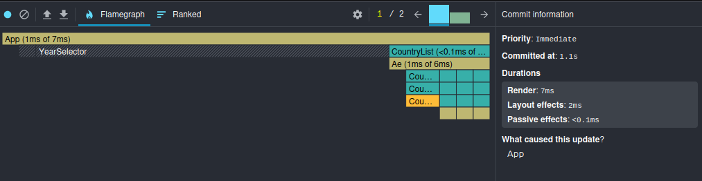
